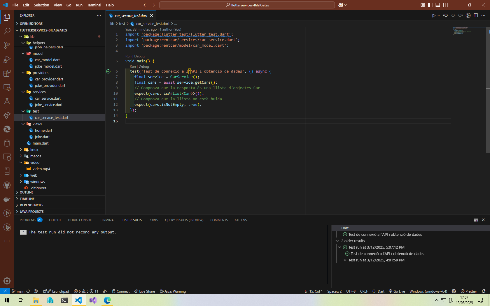

# P3b: APIs i Serveis

Aquest projecte Flutter té com a objectiu demostrar la integració d'APIs REST i la gestió d'estat global en aplicacions mòbils. La pràctica combina el consum de serveis externs, la gestió dinàmica de dades mitjançant el paquet Provider i la implementació d'una interfície d'usuari reactiva.  
_Informació basada en el document de la pràctica (P3b: APIs i Serveis) :contentReference[oaicite:0]{index=0}_

---

## 1. Introducció

Aquest projecte pretén aconseguir els següents objectius:

- Consumir dades d'una API REST per obtenir informació sobre cotxes.
- Gestionar l'estat global de l'aplicació de manera eficient utilitzant Provider.
- Integrar el model i la vista per a una actualització en temps real de la interfície.
- Implementar una funcionalitat addicional per mostrar acudits aleatoris.

---

## 2. Finalitat de l'Activitat

La pràctica té com a finalitat assolir els següents resultats d'aprenentatge:

- Desenvolupar programes que integrin continguts multimèdia.
- Utilitzar tecnologies i llibreries específiques per al desenvolupament d'aplicacions mòbils.
- Implementar la gestió d'estat global que permeti compartir dades de manera eficient entre components.
- Integrar serveis externs (APIs REST) per enriquir l'experiència de l'usuari.

---

## 3. Descripció del Projecte

El projecte es divideix en diverses funcionalitats clau:

### 3.1 Consum d'API REST per Cotxes

- **Objectiu:** Connectar amb un servei REST per obtenir informació sobre cotxes.
- **Procés:**  
  - Es realitza una petició HTTP que retorna un JSON amb dades (marca, model, any, etc.).
  - El JSON es converteix en objectes de la classe `Car` que es mostren en una llista dins l'aplicació.
- **Referència d'Endpoint:** [RapidAPI Car Data](https://rapidapi.com/principalapis/api/car-data)

### 3.2 Gestió d'Estat Global amb Provider

- **Objectiu:** Gestionar l'estat global de l'aplicació per permetre una actualització dinàmica de la interfície.
- **Procés:**  
  - S'utilitza la biblioteca Provider per carregar la llista de cotxes.
  - Quan es produeixen canvis en les dades, Provider notifica els widgets corresponents per actualitzar la vista.

### 3.3 Integració Vista-Model

- **Objectiu:** Connectar la interfície d'usuari amb el model de dades.
- **Procés:**  
  - La vista mostra la llista de cotxes amb indicadors de càrrega i missatges d'error.
  - La integració es realitza a través de Provider, garantint que qualsevol actualització del model es reflecteixi immediatament a la vista.

### 3.4 Aplicació d'Acudits

- **Objectiu:** Afegeix una funcionalitat lúdica per mostrar acudits aleatoris.
- **Procés:**  
  - En prémer un botó, es realitza una petició a una API externa.
  - Es recupera un acudit en format JSON i es mostra a la interfície.
- **Referència d'Endpoint:** [Sample APIs Good Jokes](https://api.sampleapis.com/jokes/goodJokes)

---

## 4. Biblioteques i Dependències

Les tecnologies i llibreries emprades en aquest projecte són:

- **Flutter:** Framework per al desenvolupament d'aplicacions mòbils.
- **http:** Llibreria per realitzar peticions HTTP a les APIs REST.
- **provider:** Biblioteca per gestionar l'estat global i facilitar la comunicació entre components.

---

# Respon les següents preguntes amb les mateixes paraules exactament tal i com les diuen al vídeo

## Què aprendrem en aquest vídeo?

En aquest vídeo es mostra com implementar i gestionar un estat global dins d'una aplicació Flutter emprant el potent paquet Provider. Aquesta tècnica facilita compartir dades i controlar l'estat de manera eficient a través de tota l'aplicació, fent el desenvolupament més net i escalable.

## Quina comanda es fa servir en el vídeo per crear una nova aplicació Flutter?

Per iniciar un nou projecte Flutter, el vídeo explica que cal obrir el terminal i executar la comanda següent:
- flutter create nom_de_la_teva_aplicació

## Com es treu el debugger banner?

Afegint la següent línia de codi dins del widget MaterialApp o CupertinoApp:
- debugShowCheckedModeBanner: false,

---

## Test
